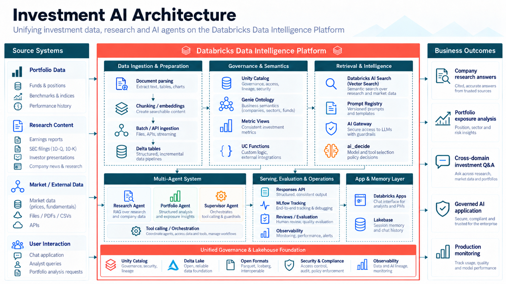

# Investment AI — Production-Ready Multi-Agent Platform on Databricks

> **Educational POC**  
> Investment AI is a fictional investment company created only for this technical demonstration. All companies, portfolio positions, research documents, financial figures, and expected results in this repository are synthetic.



## What this project is about

Databricks has many powerful AI capabilities — AI Search, Genie, Unity Catalog, AI Functions, AI Gateway, MLflow, Lakebase, Databricks Apps, agents, evaluation, and monitoring.

This project is about **connecting those pieces together** in one realistic end-to-end architecture rather than demonstrating them in isolation.

We will build a production-style **multi-agent investment research application** that can reason across both unstructured research and structured portfolio data.

Our flagship business question is:

> **Which companies lowered their outlook this quarter, why did they lower it, and how much does Investment AI own of those companies?**

Answering that question requires multiple capabilities working together:

- Research documents such as earnings reports, filings, transcripts, presentations, and analyst notes
- Structured portfolio data such as funds, holdings, prices, positions, and benchmarks
- Business semantics and governed metrics
- AI Search and RAG
- Genie and Genie Ontology
- Governed Unity Catalog functions
- `ai_decide` for structured AI decisions
- Specialized Research and Portfolio agents
- Supervisor-based multi-agent orchestration
- MLflow tracing, evaluation, and production monitoring
- Databricks Apps deployment
- Lakebase-backed conversation state
- Human review and feedback

## Architecture principle

A core design principle for this project is:

> **Not everything needs to be an agent.**

We use each capability where it makes the most sense:

```text
Reasoning              -> Specialized Agents
Document retrieval     -> Databricks AI Search
Business analytics     -> Genie + Genie Ontology
Deterministic logic    -> Unity Catalog Functions
Structured decisions   -> ai_decide
Governance             -> Unity Catalog
Observability          -> MLflow
User experience        -> Databricks Apps
Conversation state     -> Lakebase
```

## Repository structure

This repository is intentionally organized as a software project, not just a collection of notebooks.

```text
investment-ai-databricks-agent/
│
├── notebooks/                  # Step-by-step POC build and demonstrations
├── src/investment_ai_agent/    # Reusable application code promoted from notebooks
│   ├── agents/                 # Research, Portfolio, Supervisor agents
│   ├── rag/                    # Retrieval and source-authority logic
│   ├── semantics/              # Metric Views, Genie and ontology integration
│   ├── tools/                  # Governed tools and UC function wrappers
│   ├── decisioning/            # ai_decide and routing logic
│   ├── prompts/                # Application prompt definitions
│   ├── guardrails/             # Security and policy logic
│   ├── evaluation/             # Reusable evaluation helpers
│   ├── state/                  # Session and memory integration
│   └── utils/                  # Shared utilities
│
├── data/
│   ├── documents/              # Synthetic investment research corpus
│   ├── seed/                   # Structured portfolio seed data
│   └── semi_structured/        # Excel-based analyst/risk sources
│
├── evals/                      # Evaluation questions and expected results
├── security_test_documents/    # Adversarial documents used only in security testing
├── tests/
│   ├── unit/                   # Deterministic local tests
│   └── integration/            # Databricks service integration tests
├── config/                     # Project, semantic, security and evaluation config
├── setup/                      # Workspace bootstrap/resource planning
├── app/                        # Databricks App integration
├── deployment/                 # Deployment resources added later in the build
├── docs/
│   ├── architecture/           # Architecture diagram and explanation
│   ├── decisions/              # Architecture Decision Records
│   └── video/                  # YouTube planning and narration notes
│
├── PROJECT_INDEX.md            # Full POC topic index
├── REPO_GUIDE.md               # Repository walkthrough
├── pyproject.toml
└── README.md
```

## How we will build it

The notebooks are our learning and experimentation layer. Once a component becomes stable, its reusable implementation moves into `src/`.

```text
Notebook exploration
        ↓
Reusable src/ code
        ↓
Unit + integration tests
        ↓
Evaluation
        ↓
Databricks App
        ↓
Deployment + production monitoring
```

This lets the repository grow with the project instead of leaving most of the implementation inside notebooks.

## Synthetic dataset

The starter repository contains a synthetic investment dataset for five fictional companies:

| Security ID | Company | Q2 2026 guidance outcome |
|---|---|---|
| IA-SYN-01 | Synthetic Compute Company 01 | Lowered |
| IA-SYN-02 | Synthetic Energy Company 02 | Lowered |
| IA-SYN-03 | Synthetic Retail Company 03 | Maintained |
| IA-SYN-04 | Synthetic Health Company 04 | Raised |
| IA-SYN-05 | Synthetic Industrial Company 05 | Maintained |

The final application should independently discover from the research corpus that:

- IA-SYN-01 lowered guidance and Investment AI owns **$220M**
- IA-SYN-02 lowered guidance and Investment AI owns **$85M**
- Combined affected exposure is **$305M**

The production agents must **not** read `evals/private_ground_truth/`. That folder exists only for evaluation and validation.

## Research corpus

The project includes synthetic research material across multiple formats:

- PDF
- DOCX
- HTML
- TXT
- CSV
- XLSX
- JSON

This lets the POC demonstrate a more realistic ingestion and retrieval workflow instead of assuming every source arrives as clean text.

## POC roadmap

The full build covers:

1. Project architecture and repository setup
2. Databricks environment validation
3. Unity Catalog foundation
4. Investment data landing
5. Delta Lake portfolio modeling
6. Multi-format document ingestion
7. Semantic chunking and metadata
8. Databricks AI Search
9. Research Agent
10. Business semantics and Metric Views
11. Genie Agent
12. Genie Ontology
13. Unity Catalog Functions
14. `ai_decide`
15. Portfolio Agent
16. Supervisor and multi-agent orchestration
17. MLflow tracing and evaluation
18. Prompt-injection and security testing
19. Production code refactoring
20. Prompt Registry
21. Unity AI Gateway
22. Responses API serving contract
23. Databricks Apps deployment
24. Production performance analysis
25. Lakebase conversation memory
26. Human review
27. Production quality monitoring
28. Final end-to-end demo

See [`PROJECT_INDEX.md`](PROJECT_INDEX.md) for the detailed project index.

## Getting started

### 1. Create a GitHub repository

Create an empty GitHub repository, for example:

```text
investment-ai-databricks-agent
```

Do not initialize it with another README, `.gitignore`, or license if you plan to upload this repository as-is.

### 2. Push this project to GitHub

From the project folder:

```bash
git init
git add .
git commit -m "Initial Investment AI POC structure"
git branch -M main
git remote add origin https://github.com/<YOUR_GITHUB_USERNAME>/investment-ai-databricks-agent.git
git push -u origin main
```

For the YouTube build, you can optionally create a development branch:

```bash
git checkout -b develop
git push -u origin develop
```

### 3. Clone it into Databricks

In Databricks:

```text
Workspace
  -> Git folders
  -> Add Git folder / Clone repository
  -> Paste the GitHub repository URL
  -> Select your Git credentials
  -> Clone
```

After cloning, the full project structure should be visible inside the Databricks Git folder.

### 4. Start with Notebook 00

Open:

```text
notebooks/00_environment_check.ipynb
```

That notebook validates the Databricks environment before we create any project resources.

From there, the remaining notebooks will be built one step at a time as the POC progresses.

## Important project rules

- Everything in this repository is synthetic and for educational use.
- Evaluation ground truth must never be exposed to production agents.
- Security-test documents must not be indexed before the security phase.
- Reusable code should move from notebooks into `src/` once stable.
- Secrets and credentials must never be committed to Git.
- `.env.example` is only a template; do not commit a real `.env` file.

## Validation

The starter repository includes basic validation tests. From a local Python environment:

```bash
python scripts/validate_repo.py
pytest tests/unit
```

These checks verify the expected repository contract and the synthetic portfolio ground truth.

## Project status

This repository is intentionally a **starter** for the YouTube build.

Notebook `00_environment_check.ipynb` is included. The remaining notebooks and production implementation will be created progressively so the repository reflects the actual development journey shown in the series.

---

### Disclaimer

This project is for educational and technical demonstration purposes only. It does not represent investment advice, financial recommendations, or a real investment-management company.
